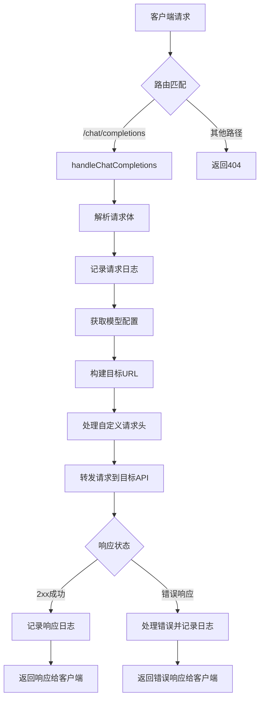

# LLM Hub - AI模型访问代理

LLM Hub是一个使用TypeScript编写的高性能AI模型访问代理，通过OpenAI兼容API接口，实现对多种AI服务提供商（如vLLM、Ollama、DeepSeek、Aliyun、OpenRouter等）的统一代理访问。该项目专为需要集成AI能力的应用系统设计，提供集中参数控制和客户端自定义的灵活管理。

## 🔧 核心功能

### AI模型访问代理
- 屏蔽后端服务差异，提供集中参数控制和客户端自定义的灵活管理
- 支持多种AI服务提供商（Ollama, DeepSeek, Aliyun, OpenRouter等）
- 通过标准OpenAI接口提供对多种大语言模型的访问能力

### 高效请求处理
- 支持多种模型或多模型版本切换，满足不同场景需求
- 完整的请求和响应日志记录，通过requestId关联请求和响应
- Token统计功能，精确计算prompt tokens和completion tokens

### 安全与配置
- HTTPS证书验证配置，支持为特定主机配置CA证书
- 自定义请求头处理，支持添加、替换和删除请求头
- 灵活的模型配置，支持多种配置结构

### 日志与监控
- 完整的请求/响应日志记录，支持日志轮转
- 模型效果评估 - 对比不同模型对相同请求的响应差异
- 参数调优 - 分析温度、提示词等参数对结果的影响
- 质量监控 - 持续跟踪模型输出质量变化
- 效果复现 - 重现特定场景下的模型表现

## 📋 适用用户

### AI应用开发者
通过OpenAI兼容API接口使用各种大语言模型，无需关心底层实现细节。

### 内部系统集成工程师
通过统一代理访问不同后端AI服务，简化系统集成复杂度。

## 🎯 应用场景

### 多模型统一访问
开发者可通过标准OpenAI接口调用DeepSeek、Qwen、Ollama等不同提供商的模型。

### 企业AI服务管理
系统通过代理统一管理对不同AI服务的访问，降低维护成本。

### AI服务监控与分析
团队通过完整的日志功能监控AI服务使用情况，进行效果评估和参数调优。

## ⚙️ 系统架构

### 核心组件

- **主服务文件**：[index.ts](./src/index.ts) - 应用入口点，启动代理服务器
- **配置文件**：
  - [model.config.json](./config/model.config.json) - 模型配置文件，定义不同AI服务提供商的模型配置
  - [certs.config.json](./config/certs.config.json) - 证书配置文件，管理HTTPS连接的CA证书
- **核心模块**：
  - [server.ts](./src/server.ts) - 服务器启动和路由处理，管理HTTP服务器生命周期
  - [requestHandler.ts](./src/requestHandler.ts) - 请求处理逻辑，处理客户端请求并转发到目标API
  - [configLoader.ts](./src/configLoader.ts) - 配置加载器，加载和管理模型及证书配置
  - [logger.ts](./src/logger.ts) - 日志系统，记录请求和响应日志，支持日志轮转
  - [tokenizer.ts](./src/tokenizer.ts) - Token统计模块，计算prompt和completion tokens
  - [types.ts](./src/types.ts) - TypeScript类型定义，定义项目中使用的数据结构

### 请求处理流程



## 📁 配置说明

### 模型配置(model.config.json)

模型配置文件采用JSON格式，支持多个提供商(provider)的配置。每个提供商可以配置多个模型。

#### 配置结构

模型配置支持两种结构：

1. **标准结构**：模型配置在 `models` 字段下
2. **特殊结构**：模型直接在 provider 下（会自动过滤掉保留字段如 baseUrl, completionsPath, apiKey, customHeader）

```json
{
  "provider名称": {
    "baseUrl": "API基础URL",
    "completionsPath": "聊天补全接口路径",
    "apiKey": "API密钥(可选)",
    "customHeader": {
      "add": {
        "header名称": "header值"
      },
      "replace": {
        "客户端header名称": "上游header名称"
      },
      "remove": ["要删除的header名称"]
    },
    // 标准结构使用models字段
    "models": {
      "modelKey": {
        "modelName": "实际模型名称",
        "temperature": "默认温度参数"
      }
    }
  }
}
```

#### 模型标识符命名规则

模型在系统中的唯一标识符采用 `${provider}/${modelKey}` 格式，其中：
- `provider` 是配置文件中的提供商名称
- `modelKey` 是模型在配置中的键名

例如，在配置中定义的 `ollama/gpt-oss` 模型，在客户端请求时需要指定 `"model": "ollama/gpt-oss"`。

#### 自定义请求头处理

支持对请求头进行添加、替换和删除操作：

- **添加(add)**：向请求中添加新的header，支持占位符替换
- **替换(replace)**：将客户端发送的header名称替换为上游API期望的名称
- **删除(remove)**：从请求中移除指定的header

##### 占位符替换机制

在 `add` 操作中，可以使用 `{propertyName}` 格式的占位符从提供商配置中提取值。例如：

```json
{
  "customHeader": {
    "add": {
      "Authorization": "Bearer {apiKey}"
    }
  },
  "apiKey": "sk-xxx"
}
```

在处理请求时，`{apiKey}` 会被替换为提供商配置中的 `apiKey` 值。

#### 示例配置

##### 标准结构示例

```json
{
  "ollama": {
    "baseUrl": "http://localhost:11434",
    "completionsPath": "/v1/chat/completions",
    "apiKey": "",
    "customHeader": {
      "add": {
        "x-gateway-apikey": "{Authorization:bearer}"
      },
      "remove": ["Authorization"]
    },
    "models": {
      "gpt-oss": {
        "modelName": "gpt-oss:20b",
        "temperature": 0.1
      }
    }
  }
}
```

##### 特殊结构示例

```json
{
  "aliyun": {
    "baseUrl": "https://dashscope.aliyuncs.com/compatible-mode",
    "completionsPath": "/v1/chat/completions",
    "apiKey": "sk-811420*******229b25cd141f1aeaa21",
    "customHeader": {
      "add": {
        "Authorization": "Bearer {apiKey}"
      }
    },
    // 特殊结构直接在provider下定义模型
    "q3": {
      "modelName": "qwen3-max",
      "temperature": 0.1
    },
    "q3-vl-235b": {
      "modelName": "qwen3-vl-235b-a22b-thinking",
      "temperature": 0.1
    }
  }
}
```

### 证书配置(certs.config.json)

证书配置文件用于管理HTTPS连接的CA证书。配置为一个数组，每个元素代表一个主机的证书配置。

#### 配置结构

```json
[
  {
    "hostname": "目标主机名",
    "certPath": "证书文件路径(可选)", // 可选字段，如果不提供则不会加载证书
    "must": true/false // 是否强制使用证书验证
  }
]
```

#### 证书验证行为

- 当 `must` 设为 `true` 且证书文件可访问时，将强制使用证书验证
- 当 `must` 设为 `true` 但证书文件不可访问时，会降级为跳过证书验证，并在日志中记录警告
- 当 `must` 设为 `false` 时，无论证书文件是否存在都会跳过证书验证

#### 示例配置

```json
[
  {
    "hostname": "api.deepseek.com",
    "certPath": "/etc/letsencrypt/live/example.com",
    "must": false
  },
  {
    "hostname": "localhost",
    "must": false
  }
]
```

## 🛡️ 安全机制

### 请求头处理

支持对请求头进行添加、替换和删除操作：

- **添加(add)**：向请求中添加新的header，支持占位符替换
- **替换(replace)**：将客户端发送的header名称替换为上游API期望的名称
- **删除(remove)**：从请求中移除指定的header

#### 占位符替换机制

在 `add` 操作中，可以使用 `{propertyName}` 格式的占位符从提供商配置中提取值。例如：

```json
{
  "customHeader": {
    "add": {
      "Authorization": "Bearer {apiKey}"
    }
  },
  "apiKey": "sk-xxx"
}
```

在处理请求时，`{apiKey}` 会被替换为提供商配置中的 `apiKey` 值。

### 证书管理

- 支持为特定主机配置CA证书
- 可配置是否强制使用证书验证([SSL]标记)
- 证书验证失败时自动降级为跳过验证

## 📊 日志系统

### 日志存储

- 日志文件存储在项目根目录下的`logs`文件夹中
- 主日志文件名为`requests.log`
- 支持日志轮转，单个日志文件最大为5MB

### 日志内容

日志记录分为两部分：
1. **请求日志**：记录客户端发送的请求体及相关上下文信息
2. **响应日志**：记录从上游服务接收到的响应体及状态信息

每条日志都包含唯一的`requestId`，用于关联同一请求的请求日志和响应日志。

### Token统计

- 自动计算并记录prompt tokens和completion tokens
- 支持多种模型的token统计
- 提供总token数统计

### 日志格式

```json
{
  "requestId": "唯一请求ID",
  "timestamp": "时间戳",
  "model": "模型名称",
  "client": "客户端信息",
  "path": "请求路径",
  "method": "请求方法",
  "body": { /* 请求体内容 */ },
  "promptTokens": 100,
  "completionTokens": 200,
  "totalTokens": 300
}
```

## ⚠️ 错误处理

系统实现了多层次的错误处理：

1. **请求解析错误**：处理无效JSON等请求体解析错误
2. **模型配置错误**：处理未知模型或配置缺失错误
3. **网络连接错误**：处理与上游服务连接超时或失败
4. **上游服务错误**：处理上游服务返回的错误响应
5. **系统内部错误**：处理代码执行过程中出现的未预期异常

所有错误都会被记录到日志中，并返回适当的HTTP错误码给客户端。

## 🚀 部署与运行

### 技术特性

- 使用 TypeScript 5.9+ 编写，类型安全
- 模块化设计，易于维护和扩展
- 使用 pnpm 作为包管理工具
- 使用 Bun 构建跨平台独立二进制文件
- 零依赖部署，可在任何支持的平台上直接运行

### 环境变量

- `HOST`：监听地址，默认为`localhost`
- `PORT`：监听端口，默认为`7891`
- `TIMEOUT`：请求超时时间(毫秒)，默认为`300000`(5分钟)

### 启动服务

```bash
# 安装依赖
pnpm install

# 编译TypeScript代码
pnpm build

# 或者直接运行（开发模式）
pnpm dev

# 构建独立二进制文件（当前平台）
pnpm pack

# 跨平台构建
pnpm pack:macos:x64    # 构建macOS Intel版本
pnpm pack:macos:arm64  # 构建macOS ARM版本
pnpm pack:linux        # 构建Linux版本
pnpm pack:windows      # 构建Windows版本
pnpm pack:all          # 构建所有平台版本
```

启动成功后，服务将在控制台打印可用的模型配置信息。

## 💻 客户端使用

### 请求格式

客户端可以通过标准OpenAI API格式向代理发送请求：

```json
{
  "model": "provider/modelKey", // 使用模型标识符
  "messages": [
    {
      "role": "user",
      "content": "你好世界！"
    }
  ],
  "temperature": 0.7 // 可选，会覆盖模型配置中的默认温度
}
```

### 支持的端点

- `POST /chat/completions`
- `POST /v1/chat/completions`

### 客户端示例

使用curl调用服务：

```bash
curl http://localhost:7891/v1/chat/completions \
  -H "Content-Type: application/json" \
  -d '{
    "model": "ollama/gpt-oss",
    "messages": [
      {
        "role": "user",
        "content": "你好世界！"
      }
    ]
  }'
```

### 与OpenAI SDK集成

由于LLM Hub完全兼容OpenAI API，您可以直接使用OpenAI的官方SDK：

```javascript
import OpenAI from 'openai';

const openai = new OpenAI({
  apiKey: 'your-api-key', // 如果需要的话
  baseURL: 'http://localhost:7891/v1' // 指向LLM Hub代理
});

const chatCompletion = await openai.chat.completions.create({
  model: 'ollama/gpt-oss',
  messages: [{ role: 'user', content: '你好世界！' }],
});

console.log(chatCompletion.choices[0].message.content);
```

## 🔄 版本管理

### 版本控制

项目遵循语义化版本控制规范（Semantic Versioning）：
- 主版本号(MAJOR)：当你做了不兼容的 API 修改
- 次版本号(MINOR)：当你做了向下兼容的功能性新增
- 修订号(PATCH)：当你做了向下兼容的问题修正

版本标签格式：`v{主版本号}.{次版本号}.{修订号}`（例如：v1.2.3）

### 自动化发布流程

项目配置了 GitHub Actions 实现自动化发布：

1. 当有新标签推送到仓库时，自动触发 Release 创建
2. 自动构建跨平台二进制文件（macOS/Linux/Windows）
3. 自动上传构建产物到 Release 页面

### 发布新版本

使用提供的发布脚本简化发布流程：

```bash
# 给当前提交打标签并发布
./scripts/release.sh
```

脚本会引导你完成版本号确认和标签推送过程。

## 📦 最新版本特性 (v1.0.1)

在 v1.0.1 版本中，我们对构建和发布流程进行了重大改进：

### 多架构支持

现在支持构建以下平台的二进制文件：
- **macOS Intel (x64)** - 适用于 Intel 处理器的 Mac
- **macOS ARM (arm64)** - 适用于 Apple Silicon 处理器的 Mac
- **Linux (x64)** - 适用于 x86_64 架构的 Linux 系统
- **Windows (x64)** - 适用于 x86_64 架构的 Windows 系统

### CI/CD 流程优化

- 重构了 GitHub Actions 工作流，优化了作业依赖顺序
- 添加了测试作业，确保代码质量
- 更新了 GitHub Actions 到最新版本
- 改进了错误处理和安全性
- 实现了从 CHANGELOG.md 自动生成发布说明

### 构建命令

```bash
# 构建特定平台版本
pnpm pack:macos:x64    # 构建macOS Intel版本
pnpm pack:macos:arm64  # 构建macOS ARM版本
pnpm pack:linux        # 构建Linux版本
pnpm pack:windows      # 构建Windows版本

# 构建所有平台版本
pnpm pack:all
```